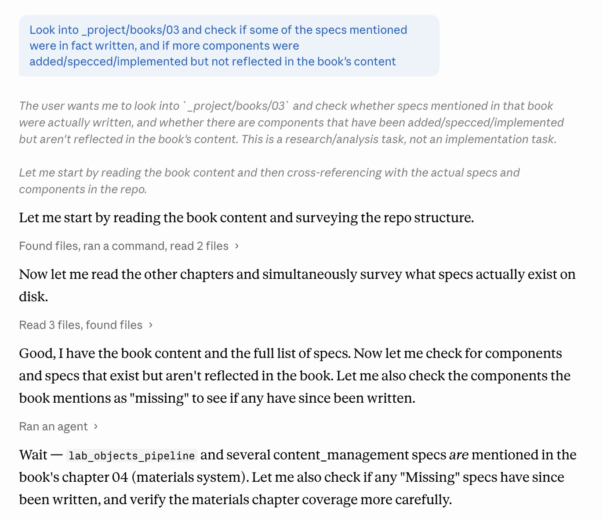

# claude-serif-patch

Restores the Anthropic-Serif patch for Claude Desktop's Claude Code tab after a software update overwrites `app.asar`.



## What it does

Claude Desktop renders the Claude Code tab (`/epitaxy/*` route) in Anthropic Sans 14px. This patch:

- switches the main prose to Anthropic Serif 15 / 400 / 1.7 and caps the transcript column at 1000 px, and
- restyles user messages back to a light-blue (`#edf3fa`), left-aligned bubble with blue (`#125c9c`) text — claude.ai now renders them grey and right-aligned.

Implementation:

- `snippet.css` — CSS rules injected as a `<style id="__anthropicSerifPatch">` element appended to `mainView.js` (webview preload). `mainView.js` no longer exposes a `webFrame.insertCSS(...)` template literal to splice into (removed upstream ~v1.14271), so the block is self-contained. Left as a defence-in-depth fallback; does not win the cascade against claude.ai's utility classes by itself.
- `snippet.js` — IIFE appended after the style-injector block. Uses `element.style.setProperty(k, v, 'important')` to apply styles inline — beats any stylesheet. A `childList` MutationObserver coalesces work into one `requestAnimationFrame`-scheduled scan per frame, so React hydration and streaming don't pile up work. No attribute observer, no setInterval — both were causing the window to hang during hydration.

Selectors target `.prose` (markdown wrapper around assistant turns), `.epitaxy-root` (the Code-tab root, where the patch sets `--chat-column-measure: 1000px`; each `[data-epitaxy-chat-column]` derives its `--max-content-width` from that variable, which otherwise falls back to 768 / 960 / 1280 px depending on the native transcript-width setting), and `.epitaxy-chat-panel [data-cds=UserMessage]` (the user-message row — it right-aligns via `ms-auto` / `items-end`, and the bubble inside is `bg-[var(--cds-bg-user-message)] text-primary`; the patch neutralizes the alignment, overrides the variable and recolours the text). User messages used to live in `.epitaxy-user-turn`. The column used to be the `.epitaxy-transcript-width` class, and before that `.epitaxy-chat-column`. Re-run the inspector and update the selectors again if styling stops matching.

## One-time setup

```bash
cd ~/makiwara/claude-serif-patch
npm install              # fetches @electron/asar
```

## Restore after an update

```bash
~/makiwara/claude-serif-patch/patch.sh
```

Flags:

- `--debug` — also inject `inspect.js` (yellow diagnostic panel, double-click any element to see 10 ancestor levels with computed font + classes). Use when selectors stop matching after an Anthropic UI change.
- `--force` — strip any prior injection (serif blocks and any `=== diagnostic` block) and re-inject. Use after editing `snippet.js` / `snippet.css` to re-apply without reinstalling from DMG, or to drop the inspector again.

Idempotent by default: if the patch marker is already in `mainView.js`, exits cleanly. Otherwise:

1. Extracts `/Applications/Claude.app/Contents/Resources/app.asar`
2. Runs `patch.mjs` to inject CSS + append the IIFE
3. Repacks the asar, mirroring the original's unpacked set (native modules, helper binaries)
4. Recomputes the ASAR header SHA-256 and writes it into `Info.plist:ElectronAsarIntegrity:Resources/app.asar:hash`
5. Re-signs the bundle ad-hoc (`codesign --force --deep --sign -`)
6. Clears the quarantine xattr
7. Verifies the signature

## Files

- `patch.sh` — driver, run this
- `patch.mjs` — Node script that edits `mainView.js` in place
- `snippet.css` — CSS injected as a `<style>` element appended to `mainView.js`
- `snippet.js` — IIFE appended after the style-injector block
- `inspect.js` — double-click element inspector, injected with `patch.sh --debug`
- `package.json` — declares `@electron/asar` dependency

## Element inspector

`inspect.js` adds a yellow panel to the top-right of the Claude window. Double-click any element on the page to see 10 ancestor levels with tag, computed font-family / font-size / line-height, and class list.

Use it when the prose stops picking up serif, the column width drifts, or user bubbles turn grey / right-aligned again (Anthropic changed class names). Double-click the element and copy the class chain from the panel:

```bash
~/makiwara/claude-serif-patch/patch.sh --force --debug  # inject inspector alongside the serif patch
# double-click the unstyled element in Claude
# update selectors in snippet.js
~/makiwara/claude-serif-patch/patch.sh --force          # re-inject without inspector
```

## When it might break

- Anthropic changes the `.prose` / `.epitaxy-root` / `.epitaxy-chat-panel` classes, the `data-cds=UserMessage` attribute, the `--chat-column-measure` variable, or the `--cds-bg-user-message` / `ms-auto` / `items-end` utilities the bubble relies on. Selectors in `snippet.js` need updating — use `--debug` to find the new ones.
- Bundler restructures `mainView.js`. Injection is anchor-independent (the block is appended before the `sourceMappingURL` comment, or at end of file), so this is unlikely to break silently, but the `--force` strip regexes rely on each block ending with `})();` on its own line.
- Electron adds per-file (not just per-asar-header) integrity verification at launch. Current Claude Desktop uses a single top-level hash, which this script updates.
- Claude is re-signed with a newer Developer-ID and something in the app depends on the original signature (e.g. keychain items scoped to the team ID). Ad-hoc re-signing loses notarisation; any such features stop working. No workaround short of Anthropic shipping the change upstream.

- Auto-updates stop installing while the app is patched: Squirrel/ShipIt validates the downloaded update against the running app's code requirement, and the ad-hoc signature doesn't satisfy it (`Code signature … did not pass validation` in `~/Library/Logs/Claude/main.log`). Install updates from the DMG, then re-run `patch.sh`.

## Rollback

Reinstall Claude Desktop from the DMG; the installer overwrites `app.asar`, `Info.plist`, and the signature in one shot. Or, if you still have the per-run backup files:

```bash
cp /Applications/Claude.app/Contents/Resources/app.asar.backup2 /Applications/Claude.app/Contents/Resources/app.asar
cp /Applications/Claude.app/Contents/Info.plist.backup          /Applications/Claude.app/Contents/Info.plist
codesign --force --deep --sign - /Applications/Claude.app
```
